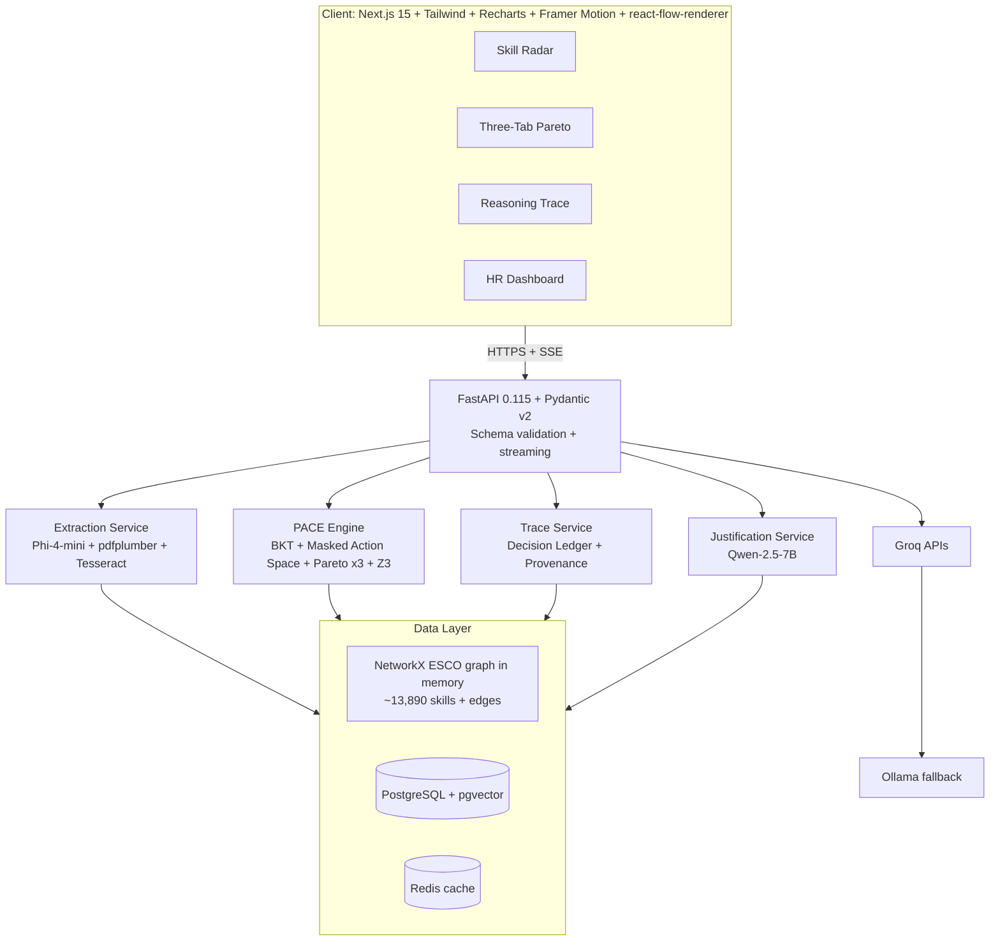

# NEXUS
# video - https://drive.google.com/file/d/1uRhj1Lbi23cG2W4VIdGyhBCFZeNqKmq5/view?usp=drivesdk

Z3-verified, adaptive onboarding intelligence for role-specific learning paths.

## Problem Statement

Traditional onboarding is static: same modules, same sequence, same time cost for radically different people. NEXUS solves this by generating personalized pathways that are:

- Grounded in a real skills ontology.
- Constrained by prerequisite logic.
- Measured by explicit mastery math.
- Formally verified before delivery.

The target outcome is higher Competency Velocity Score (CVS): greater mastery gain per hour than legacy one-size-fits-all onboarding.

## One-Command Setup

```bash
docker compose up --build
```

This boots the full stack and serves the application for demo use.

## System Architecture



## Core Logic: PACE Engine

NEXUS planning is deterministic and auditable:

1. Extract skills from resume and JD.
2. Link entities to ESCO skill nodes.
3. Initialize mastery matrix with BKT priors.
4. Build eligible modules using masked action space: block modules with unmet prerequisites.
5. Score eligible modules with multi-objective reward:

  - Speed path: \(\lambda = 2.0\)
  - Balance path: \(\lambda = 1.0\)
  - Depth path: \(\lambda = 0.2\)

6. Verify each generated path with Z3.
7. Stream paths and trace to UI.

## BKT Mechanics

For each skill \(k\), NEXUS tracks:

- \(P(L0_k)\): initial mastery.
- \(P(T_k)\): transition probability.
- \(P(S_k)\): slip probability.
- \(P(G_k)\): guess probability.

Posterior updates after evidence:

$$
P(L\mid correct)=\frac{P(L)(1-P(S))}{P(L)(1-P(S)) + (1-P(L))P(G)}
$$

$$
P(L\mid incorrect)=\frac{P(L)P(S)}{P(L)P(S) + (1-P(L))(1-P(G))}
$$

Transition after learning action:

$$
P(M_k)=P(L_k)+(1-P(L_k))P(T_k)
$$

### Worked Example (Docker Skill)

From the PRD scenario:

- Initial mastery from extraction and recency: \(P(L)=0.32\)
- Evidence update raises latent mastery to \(P(L)=0.554\)
- Foundational transition probability \(P(T)=0.35\)

Then:

$$
P(M)=0.554 + (1-0.554)\cdot 0.35
=0.554 + 0.1561
=0.7101 \approx 0.71
$$

So the module moves Docker mastery from 0.32 baseline to approximately 0.71 projected mastery.

## Formal Verification with Z3

NEXUS checks every candidate path against four hard rules:

1. CATALOG_MEMBERSHIP
  - Every selected module id must exist in catalog.
2. PREREQUISITE_SATISFIED
  - For each module, all prerequisite skills must satisfy mastery threshold \(P(M) > 0.85\).
3. NO_CYCLES
  - The prerequisite subgraph over selected modules must be acyclic (topological ordering exists).
4. COMPLIANCE_MANDATORY
  - Every mandatory module must be included.

### Proof Sketch for Reliability

If all four constraints hold, then:

- No non-catalog module can appear in output.
- No module can appear before unmet prerequisites.
- No cyclic dependency can break execution order.
- No mandatory compliance requirement can be bypassed.

Therefore, path validity is not heuristic; it is solver-validated.

## Evaluation Lens

- Competency Velocity Score:

$$
CVS=\frac{\sum_k \Delta P(M_k)}{\text{Total Path Hours}}
$$

- Legacy baseline is computed from catalog-derived static sequence, then compared directly to NEXUS paths.

## Dataset Sources and License Notes

1. ESCO v1.2
  - Source: European Commission Open Data Portal.
  - Use: primary skill graph, multilingual labels, prerequisite and similarity structure.
  - License note: open public data from EC portal (cite official ESCO source in submissions).

2. O*NET 28.0
  - Source: O*NET / U.S. Department of Labor public releases.
  - Use: importance-derived criticality weights for reward scoring.
  - License note: free/public distribution under O*NET terms.

3. ESCO-O*NET Crosswalk
  - Source: official mapping on ESCO portal.
  - Use: interoperability between ESCO and O*NET skill semantics.
  - License note: follow source attribution requirements from official crosswalk publication.

4. Synthetic corpora (resumes, JDs, course catalog)
  - Use: controlled stress-testing, negative sampling, and hackathon demo simulation.
  - License note: internally generated simulation data; explicitly labeled as training/demo simulation.

## Honest Limitations

1. Parameter calibration is still domain-sensitive.
  - BKT defaults are principled but may require organization-specific tuning.

2. Catalog coverage governs output quality.
  - If required skills have no mapped modules, NEXUS must surface external resource required gaps.

3. Emerging tools may be underrepresented in ontology.
  - Entity linking can miss novel or niche skills outside ESCO/O*NET overlays.

4. Extraction quality depends on document quality.
  - Image-heavy or unusual resume layouts can reduce confidence despite OCR fallback.

5. NEXUS plans; it does not claim autonomous RL learning.
  - Adaptation is via BKT posterior updates and constrained replanning, not online policy learning.

## Why This Is Competition-Strong

- Technical depth without black-box dependence.
- Explainability for both technical and HR audiences.
- Formal verification for reliability claims.
- Demo-safe architecture with caching and fallback.

## Quick Access

- Application UI: http://localhost:3000
- API docs: http://localhost:8000/docs

